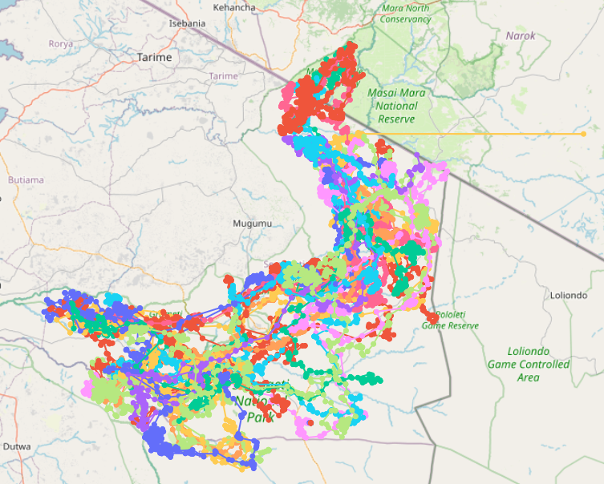

# Serengeti Mammal Analysis & Research Tool (SMART)

## Overview

### Authors

We are William Stanziano and Christopher Tillotson, students in Dr. Ron Smith’s Automation & Workflows class during the Fall 2025 semester. Christopher Tillotson is an assistant research student for Dr. Jennifer Swenson. This project is a final project for Dr. Smith's class and also relates to and assists the research of Dr. Swenson.

### Description

This project is a tool which webscrapes from a website that hosts data on animal movements in the Serengeti. This is to enable an archive of the data as well as very specific querying by time, location, species, or specific animal. The data can then be used as a ground-truth reference for SAR images which are planned to be taken of large mammals in the Serengeti. The project utilizes uv to manage library dependencies, and launches as a dashboard utilizing Dash by Plotly framework. This launches in the user's default web browser.

## Setup Instructions
1. Download and install uv

https://docs.astral.sh/uv/

2. Navigate to the `src` directory of this repo in your CLI.
3. Run the command `uv sync` to sync the required libraries with the local venv this will create.
4. Run the app with `uv run appfour.py`. This will launch the app in your default web browser on a local port. 

After the initial sync, unless this repo is edited to include more libraries, subsequent sessions of running the app will not require `uv sync`.

## Using the App
1. Set your desired parameters using the query options on the left. (Selecting none will select all possible values.)
2. Press **Generate Query** to create the query based on your parameters. You may optionally view the SQL query and parameters passed in by checking "Show SQL"
3. Press **Run Query** to execute the query.
4. Export the results by pressing **Export CSV**. The output CSV contains the following rows:
   - `serialId`
   - `date`
   - `collarId`
   - `latitude`
   - `longitude`
   - `positionId`
   - `species_id`
   - `first_scraped` (date when the animal was first scraped)
   - `last_scraped` (date when the animal was last scraped)
   - `species_name`

## Notes on Webscraping
- Webscraping can be performed at any time and runs in the background, to start it press **Webscrape**. This will start the process and disable pressing it while it loads. This requires an internet connection. 
- The timezones listed are 
    - UTC+03 Eastern Africa Time, the local timezone of the Serengeti.
    - UTC-05 Eastern Standard Time, the local timezone of where the intended user will perform this (William & Mary).
    - UTC Zulu (GMT) Time, standard time at UTC+00 and the time that the data is stored in.
- The **last_scraped** field will update automatically when scraping completes.
- The source website hosts data for only the most recent 3 months. To avoid missing data, scraping should be done at least every two months, though it typically completes within a few minutes and can be done more frequently.
- Webscraping does not need to be performed everytime the app is launched. When the app is launched, all data currently in the databasefile will be available. 